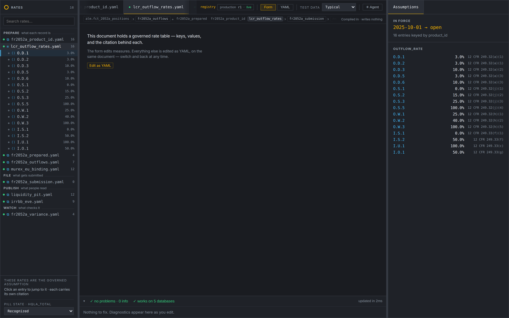
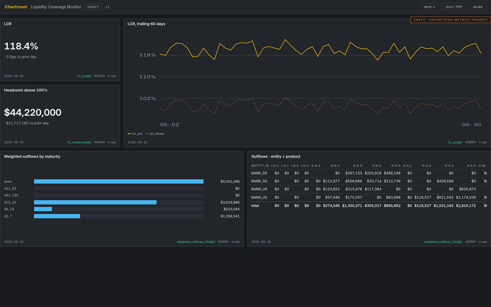
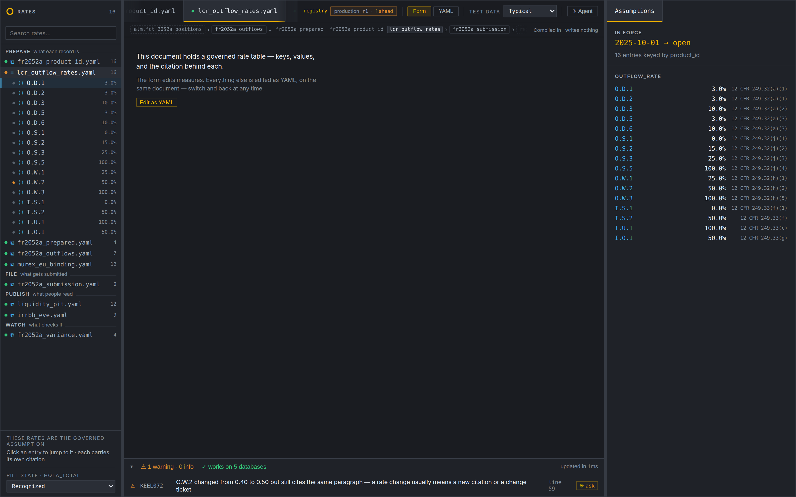
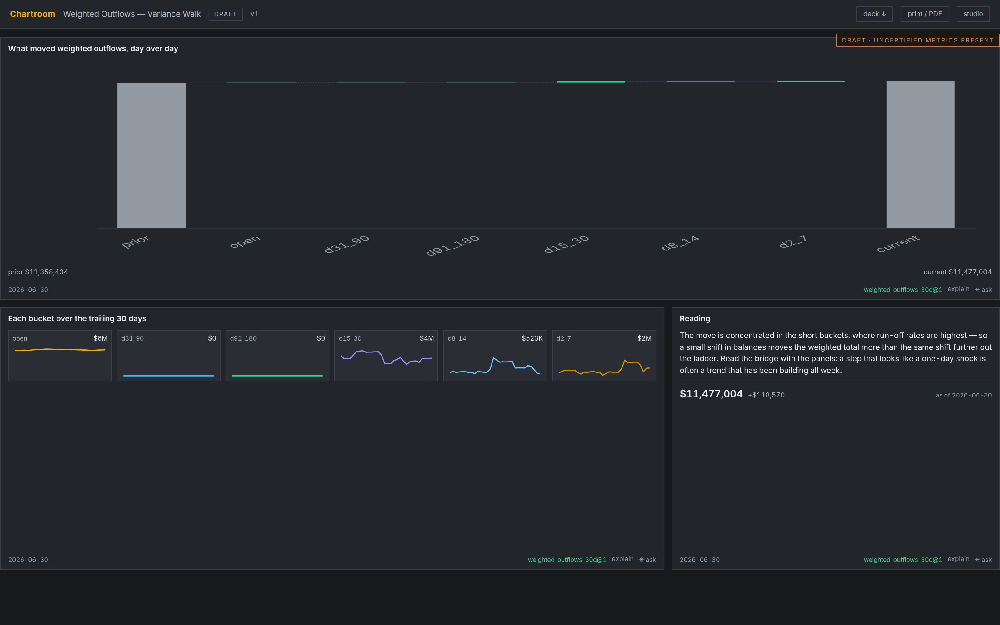
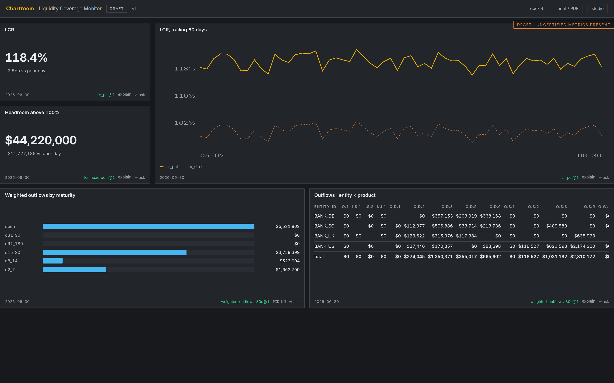
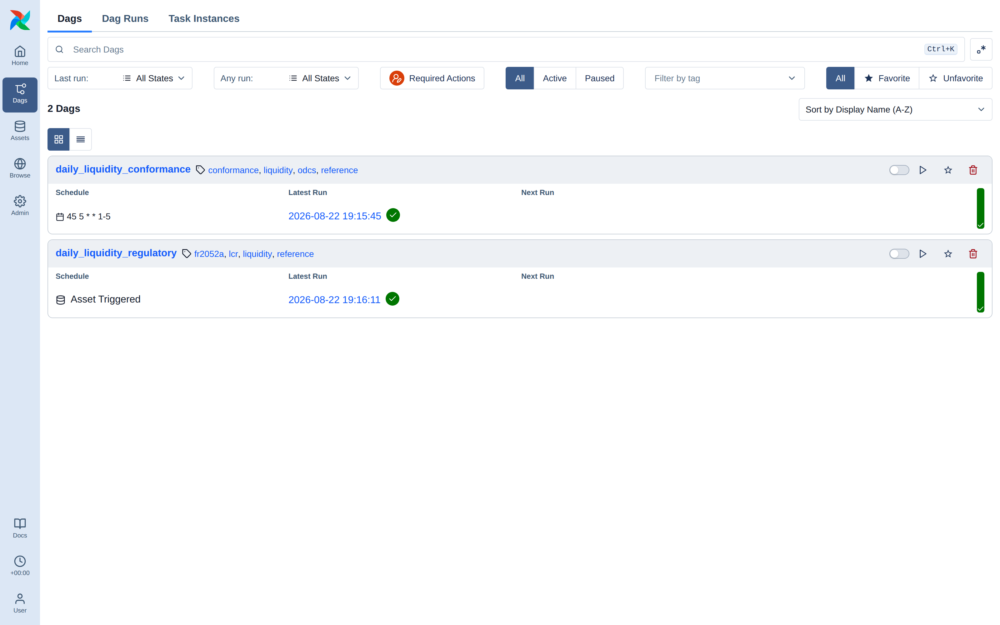
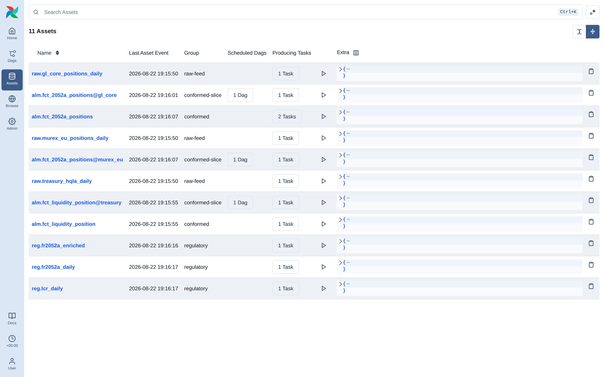

# Product definition

Two surfaces over one governed metrics registry.

**The Metrics Definition Layer** is where a definition is authored: a liquidity
analyst writes an FR 2052a rule, watches the number it produces, and reads the
plan the nightly pipeline will run. **Chartroom** is where a definition is
consumed: an agent-guided studio for dashboards whose every number traces back
to a registry function.

They are one product because they answer the same question at two ends of the
same pipe — *is this number right, and can I prove it?* — and because the
second is only credible if the first is real. A dashboard that cites a
governed definition is worth something only when that definition is itself
authored, versioned, and reviewed somewhere you can point at.

---

## 1. The problem

A regulated number has a long way to travel between the rule that defines it
and the slide a committee approves. Today it is retyped at every hop.

`lcr_pct` is defined once, under an SR 11-7 tier, with a citation and a
revision history. Then somebody writes `100.0 * [HQLA] / [Net Outflows]` into a
Tableau calculated field, and *that* is the number the committee sees. The two
drift — a rounding rule here, a filter there — and the drift is undetectable
because nothing compares them.

**Drift you cannot detect is worse than a wrong number you can.** A wrong
number gets caught and fixed. Undetected drift gets defended, because both
sides are certain they are reading the governed figure.

The dashboard half has its own version of this. Users vibe-code one-off HTML
dashboards: creative, fast, and ungoverned. The output cannot be reviewed or
diffed, reaches data through ad-hoc paths with unknown performance, embeds
calculation logic that duplicates and then drifts from the governed
definition, and has no path from "my thing" to "the team's thing" to "the
certified thing."

## 2. What we build instead

**The agent never writes dashboard code.** It writes a *dashboard spec* — a
declarative document where every number is a registry reference and every
visual comes from a reviewed widget catalog. The spec is the unit of review,
versioning, linting, and promotion. Rendering is a deterministic interpreter,
so performance is a property of the platform rather than of whatever HTML the
agent happened to emit that day.

**The engine is the single source of every number.** The definition compiles
once, to SQL, Polars, and PySpark, and to the semantic views a BI tool points
at. When a warehouse serves a query, it runs the engine's own compiled SQL —
not a reimplementation that agrees today.

## 3. Three promises

1. **Control.** Every calculation is a governed semantic function; every visual
   passes the design guide; every dashboard is a reviewable artifact with
   lineage and an audit trail naming the human behind each act.
2. **Performance against real data.** One query compilation path, an
   aggregates-only boundary that is structural rather than policed, and
   pushdown to the warehouse. No client-side full-table hauls.
3. **A promotion pipeline.** draft → team → certified, with human approval
   gates, pinned registry revisions, and outward registration for
   discoverability and lineage.

## 4. Principles

**P1 — Spec-first, never code-first.** Freeform HTML/JS is structurally
impossible, not merely discouraged. Custom visuals enter through the widget
catalog's own review process.

**P2 — The registry is the only data API.** A widget binds
`metric_ref + dims + filters + params`. There is no raw SQL surface in a
dashboard spec. A calculation that doesn't exist becomes a *proposal*, not
inlined math.

**P3 — Plan before pixels.** A Design Brief is approved before anything is
composed. The brief is a first-class artifact, so intent is auditable when a
dashboard is challenged later.

**P4 — The design guide is executable.** Not a PDF the agent "adheres to" — a
linter with rule IDs, golden tests, and one-click fixes. Style is enforced the
way schema is enforced.

**P5 — Compose from patterns, justify departures.** Instantiate a reviewed
archetype or write down why none fits. The single biggest lever against
dashboard sprawl.

**P6 — Humans approve at every boundary.** The agent proposes; named humans
approve. This is the SR 11-7 posture: the agent is a development tool, never an
approver. Approval, stewardship decisions, and promotion are refused to
`agent:*` identities at the API — permanently, not by configuration — and the
registry's tool surface holds the same line: an `agent:*` connection is never
even offered the save, cut, or promote tools, whatever the write flag says.
The same seam runs between humans: a weakened tier-1 rule needs a second
person's review before a release can pin it, and whoever cuts that release
cannot be the only name deploying it (ADR-57).

**P7 — Refuse rather than guess.** Every layer would rather say what it cannot
do than produce something plausible. The compiler refuses to emit SQL for
`ema()` instead of approximating it. A gauge with no declared limit direction
draws the gap and declines to call it a breach. A stacked area whose bands go
negative renders a refusal instead of clamping them and overstating the total.
A model outage degrades to a banner, never a block.

## 5. Who it is for

| Role | What they do here |
|---|---|
| **Definition author** (ALM/liquidity analyst) | Writes rules, watches the number and its derivation trace, reads what a change would move |
| **Dashboard author** | Talks to the agent, approves the brief, iterates against live numbers |
| **Metric steward** | Decides proposals; approval *is* a registry write |
| **Design steward** | Owns the guide and the widget/pattern catalogs |
| **Reviewer / committee** | Reads a versioned artifact with its brief, lint report, and commentary attached |

## 6. What ships today

Nine phases are built, verified, and merged. The engine and both surfaces run.

**Authoring** — seven document kinds (`metrics_view`, `classification`,
`parameter_set`, `report`, `variance_monitor`, `source_binding`,
`prepared_source`), each with
its own answer to "is this right?"; a real CodeMirror editor; compilation to
SQL/Polars/PySpark plus semantic views and dbt models; a conformance suite that
runs the compiled plans in real interpreters and requires them to agree; and a
definition agent in a rail beside the editor that drafts full document bodies,
proves them with the same diagnostics and impact assessment a person is held
to, and hands the body over — the save stays a human act, under the author's
own name.

**Chartroom** — the spec DSL and a 20-rule linter with golden tests and
mechanical fixes; a catalog of 12 widgets and 6 patterns; the agent loop
(intake → brief → compose → critique) over 28 governed MCP tools; briefs with a
human approval gate; metric proposals validated through the real engine; the
draft/team/certified promotion matrix with sign-offs and exposure records;
version-pin upgrade notices carrying the diff; a deterministic data critic;
cross-filtering; PPTX committee packs; a shareable read-only view mode; usage
instrumentation; a read-first analyst mode whose exception strip runs the
workspace's own variance monitors (governed threshold ids as the codes); and
the design agent as a left rail — completions from real things, pointers that
carry a widget's binding and the reader's environment, and the same honest
degrade when no model is there.

**The agent runtime** is one Python LangGraph + deepagents service on FastAPI
serving two surfaces by configuration: the studio's design agent over the
chartroom roster, and the authoring surface's definition agent over the
registry's — a roster that structurally cannot write. Durable threads, one
frozen SSE protocol, and per-surface system prompts that encode each
surface's journey.

**Query backends** are a routing decision: `fixtures | duckdb | dremio`.
Fixtures remain the default *and the test oracle* — a parity harness runs every
query shape against both engines over identical rows and requires agreement to
1e-6. Warehouse execution compiles the engine's own measure SQL and row-stage
derivations, so there is one definition of every number.

**The escape hatch is real.** Widget contracts and patterns are versioned rows
in a table, not code constants, and they enter through the same proposal →
steward → publish path metrics use. A contract may be approved before a
renderer exists — flagged unrenderable rather than refused, so design review
never queues behind implementation.

**The nightly pipeline** — `pipelines/liquidity` is a reference
implementation of the run these definitions are authored for: daily positions
sourced under Open Data Contracts, conformed by dbt-core into tables
sub-partitioned by producing source system, then the governed rules, the LCR
and the FR 2052a submission taken from the registry's deployed channel at run
time. Two Airflow 3.3 DAGs joined by partitioned assets; DuckDB in dev and CI,
Spark over Iceberg through an Apache Kyuubi gateway as the product target.
Section 7 follows a rule change through it.

**Not yet built:** outward integrations — DataHub emission, git materialization
at Team+, decommissioning, Rogo import (Phase 11). Streaming (Deephaven)
remains a deliberate deferral behind an executor seam written to accept it.

## 7. One rule change, both paths — a walkthrough

Sections 1–6 claim that a definition authored here reaches a filed submission
and a committee dashboard without being retyped. This section shows it, with
screenshots of the running system: one governed rate is changed, and the
change is followed down **both** consumption paths — the nightly
Airflow/Spark pipeline that files FR 2052a, and the Chartroom dashboards two
liquidity desks read.

The change is deliberately small and entirely typical: **the run-off rate on
non-operational wholesale funding (`O.W.2`) moves from 40% to 50%**, a
supervisory reinterpretation. It is one line in one governed document.

The two liquidity use cases it lands in:

| | Use case | Reads | Path |
|---|---|---|---|
| **1** | **LCR coverage** — is the buffer adequate today? | `lcr_pct`, `lcr_headroom`, `weighted_outflows_30d` | pipeline files `reg.lcr_daily`; desk reads *Liquidity Coverage Monitor* |
| **2** | **FR 2052a weighted outflows** — what are we filing, and what moved? | `weighted_outflows_30d` by product × bucket | pipeline files `reg.fr2052a_daily`; desk reads *Weighted Outflows — Variance Walk* |

### 7.1 Before: the rate table as production serves it

`lcr_outflow_rates` is a governed `parameter_set` — sixteen rates, each with
the paragraph it implements. The header reads `production r1 · live`: the
workspace and the deployed channel agree.



Both dashboards, at that release. Use case 1 — LCR 118.4%, headroom
$44,220,000, weighted outflows by maturity totalling $10.50mm inside the
30-day window:



Use case 2 — the variance walk, prior $10,384,264 → current $10,502,587:


And the nightly run against that same release files:

| | as filed at `production r1` |
|---|---|
| `reg.fr2052a_daily` · weighted outflows | **$44,410,173.36** |
| of which `O.W.2` | $14,247,458.56 |
| `reg.lcr_daily` · consolidated LCR | **1456.7%** |

### 7.2 The change, and the control that fires immediately

The author edits one rate. Two things happen before anything is deployed.

The header changes to `production r1 · 1 ahead` — the workspace is one
revision beyond what the channel serves, stated rather than implied. And a
diagnostic appears against the line:

> **KEEL072** · `O.W.2` changed from 0.40 to 0.50 but still cites the same
> paragraph — a rate change usually means a new citation or a change ticket



The registry is not objecting to the number. It is objecting that a governed
assumption moved under an unchanged authority — which is exactly the case a
model-risk reviewer will ask about, raised while the author is still in the
document rather than in a quarterly review.

### 7.3 The paths diverge — on purpose

This is the part worth reading twice, because the two paths bind at
**different moments**, and the gap between them is the governance.

**Chartroom moves now.** The studio reads the workspace, so the dashboards
show the proposed number the instant it is saved — and label it. Use case 2's
walk goes from $10,502,587 to **$11,477,004**, and the board carries
`DRAFT · UNCERTIFIED METRICS PRESENT`:



Use case 1's board moves the same way, in its outflow widgets:



**The pipeline does not move.** It dereferences the `production` channel,
which still serves r1. Re-running the nightly job with the edit saved files
*exactly* what it filed before:

| | before the edit | after the edit, before promotion |
|---|---|---|
| channel release | r1 | **r1** |
| rate-table revision served | 1 | **1** |
| filed weighted outflows | $44,410,173.36 | **$44,410,173.36** |

An analyst can therefore explore a proposed rule against live numbers without
any risk of it reaching a regulatory filing — and cannot mistake the
exploration for the filed figure, because the board says so.

### 7.4 Promotion is a separate, refused-by-default act

Cutting release r2 and promoting it is refused:

```
refusing to promote r2 to production without acknowledgement — versus what
production currently serves, this weakens something:
  · lcr_outflow_rates: Changes 1 governed rate
    O.W.2: 0.40 → 0.50
    1 rate moved without its citation moving. A governed assumption changing
    under an unchanged authority is the case worth explaining.
Re-send with acknowledgeReview: true if intended.
```

The same finding as KEEL072, now blocking deployment rather than advising.
The steward promotes with an explicit acknowledgement, and the reason is
written into the channel history beside the actor:

```
r2  m.reyes  Supervisory reinterpretation of non-operational wholesale funding;
             the paragraph is unchanged, the reading of it is not. Reviewed with
             Liquidity Regulatory Reporting. [review acknowledged: Changes 1 governed rate]
r1  m.reyes  Baseline: FR 2052a rules and LCR rates as filed
```

The edit itself carries its own author (`a.okafor`, revision 2) — identity is
asserted by the proxy in front of the registry, never by the client, so the
name against a rule change is part of the control rather than a label.

### 7.5 After: the pipeline files the new number

With the channel repointed, the next nightly run picks the new rate up with
no pipeline change of any kind — no deploy, no DAG edit, no code review:

| | at `production r1` | at `production r2` | change |
|---|---|---|---|
| channel release / rate revision | r1 / 1 | r2 / 2 | promoted |
| `reg.fr2052a_daily` · weighted outflows | $44,410,173.36 | **$47,972,038.05** | +$3,561,864.69 |
| of which `O.W.2` | $14,247,458.56 | **$17,809,323.25** | +$3,561,864.69 |
| `reg.lcr_daily` · consolidated LCR | 1456.7% | **1286.0%** | −170.7pp |
| net outflows, 30d | $26,836,526.70 | $30,398,391.34 | +$3,561,864.64 |

The whole movement sits in `O.W.2` — the product whose rate changed — and the
totals move by exactly that amount. That is the arithmetic a reviewer checks
first, and it holds because one definition produced both rows.

### 7.6 What the pipeline path looks like while it runs

The nightly run is two Airflow DAGs joined by partitioned assets: each
source system conforms its own `(as_of_date, source_system)` slice, and the
regulatory DAG is started by the scheduler only once every slice for a date
exists.



The asset view is the topology: three `raw-feed` landings, three
`conformed-slice` assets (one per producing system) each scheduling the
downstream DAG, the two `conformed` tables consumers subscribe to, and the
three `regulatory` outputs the run files.



### 7.6b The same rules, a different world

A scenario is an input, not a model. The pipeline can run the identical
governed release over a stressed book — deposits running harder than
contract, inflows that do not arrive, a haircut on the buffer — in its own
warehouse, so the two runs share nothing except the registry release:

| | base | stress |
|---|---|---|
| HQLA | $390,919,734.51 | $344,009,366.38 |
| filed weighted outflows | $47,972,038.05 | $59,965,047.53 |
| **consolidated LCR** | **1286.0%** | **721.7%** (−564.3pp) |

`scenarios.compare()` refuses to report a comparison whose runs came from
different releases, because a base-vs-stress figure computed across two rule
versions is not a comparison. This is the axis where drift is least visible
and most consequential: in most institutions the stressed LCR and the
reported LCR are produced by different machinery, and no one can say whether
a difference is the scenario or the implementation.

**It is not a forecast.** Nothing here projects a balance sheet forward;
multi-period projection is a modelling capability this does not have.

### 7.7 What this walkthrough is evidence for

- **One definition, two consumers, no retyping.** The filed
  `reg.fr2052a_daily` row and the dashboard widget both trace to
  `lcr_outflow_rates` revision 2. Neither holds a copy of the rate.
- **Drift is structurally unavailable**, not merely discouraged: the
  pipeline cannot read a rate the channel does not serve, and the dashboard
  cannot show one without saying whose revision it is.
- **The gate is where the risk is.** Saving is cheap and reversible;
  deploying is refused by default when it weakens a governed assumption, and
  the override is recorded with a name and a reason.
- **Binding times differ deliberately** — the studio at save, the pipeline at
  promotion — which is what lets an analyst explore a proposed rule against
  live numbers with no path to a filing.

Every figure above was produced by running the system; the screenshots are
regenerated by `docs/vision/capture.mjs` and the recipe in
[`docs/vision/README.md`](docs/vision/README.md).

## 8. Boundaries

Things that are deliberately not on the roadmap, because allowing them would
dissolve the product:

- **No raw SQL in a dashboard spec.** The moment one exists, the registry stops
  being the only data API and every guarantee above becomes advisory.
- **No row-level export from a dashboard.** The aggregates-only boundary is
  structural: row data has no representation in the query response types, so it
  cannot leak by accident. A sampled extract is a separate, server-flagged,
  allowlisted path — never a widget.
- **No agent approvals.** Not a permission to be granted later.
- **No unit overrides in presentation.** A bp metric renders as bps on every
  dashboard, or the same number reads differently in two meetings.

## 9. How we know it works

The dogfood boards are the acceptance test: hand-authored against the real
registry, seeded on first boot, and covered by a test that fails when a measure
is renamed. `outflow-walk` is built on a shipped pattern rather than a "no
pattern" justification.

Verification is one command (`npm run verify`) and currently runs 866 unit,
conformance, server and MCP tests across the TypeScript workspaces, 40 Python
tests in the agent service including the cross-backend parity harness, and 131
browser checks (95 against the authoring surface, 36 against the studio). The
liquidity pipeline carries a further 41 Python tests under its own runner.

Every architectural deviation from the pinned spec decisions is recorded in
`docs/chartroom/ADRS.md` — 62 entries (57 accepted, five proposed), including the
ones that record a mistake and its correction.
